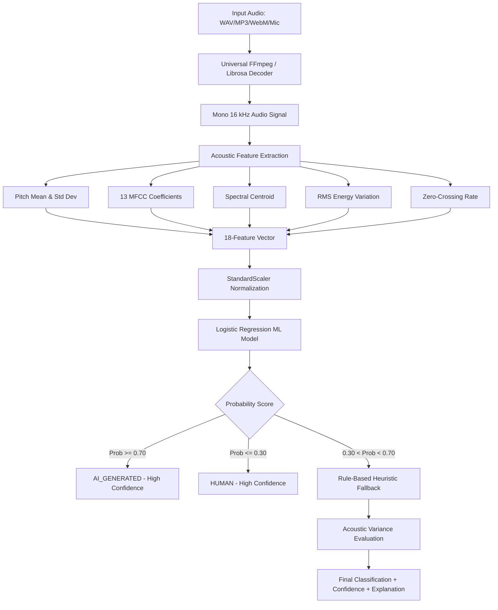

# 🎙️ VoiceGuard - Multilingual AI Voice Detection & Forensic Portal

[](https://www.python.org/)
[](https://fastapi.tiangolo.com/)
[](https://scikit-learn.org/)
[](https://librosa.org/)
[](LICENSE)

A full-stack, real-time forensic web portal and REST API to detect whether an audio voice sample is **AI-generated (synthetic / cloned voice / deepfake)** or spoken by an **authentic human**.

Built upon the research and acoustic classification pipeline of [thekripaverse/AI-Generated-Voice-Detection](https://github.com/thekripaverse/AI-Generated-Voice-Detection.git), enhanced with an interactive cyber-forensic user interface, live browser microphone recording, universal audio decoding, and acoustic feature visualization.

---

## 🌟 Key Features

- 🎧 **Three Flexible Input Channels**:
  - **Direct File Upload**: Drag-and-drop or browse audio files (`.wav`, `.mp3`, `.ogg`, `.flac`, `.m4a`, `.aac`, `.webm`).
  - **Live Browser Microphone**: Record speech directly from your microphone with an animated real-time visualizer and timer.
  - **1-Click Preloaded Demos**: Test immediately using built-in synthetic AI clips and natural human speech across English, Hindi, and Tamil without needing your own files.
- 🔬 **Acoustic Forensics Radar (18 Feature Vectors)**:
  - **Fundamental Pitch (F0)** Mean & Pitch Standard Deviation (detects unnaturally rigid mechanical pitch).
  - **13 Mel-Frequency Cepstral Coefficients (MFCCs)** visualized in an interactive bar chart.
  - **Spectral Centroid** (detects vocoder high-frequency smoothing anomalies).
  - **Root Mean Square (RMS) Energy Variance** (detects lack of dynamic vocal volume modulation).
  - **Zero-Crossing Rate (ZCR)** (micro-transients and voiceless acoustic patterns).
- 🧠 **Hybrid Decision Engine**:
  - **ML Classifier**: Standard-scaled Logistic Regression model trained to identify synthetic vocal patterns.
  - **Rule-Based Fallback**: Acoustic heuristics that resolve borderline probabilities with forensic explanations.
- ⚡ **Universal In-Memory Audio Decoder**:
  - Powered by embedded FFmpeg (`imageio-ffmpeg`) and Librosa.
  - Automatically decodes raw browser `MediaRecorder` streams (`audio/webm;codecs=opus`), mobile formats, and lossy/lossless audio containers into 16 kHz PCM float32.
- 📊 **Interactive Canvas Waveform**:
  - Custom audio player with amplitude peak rendering, click-to-seek, and playback progress tracking.
- 📜 **Session History Log**:
  - Stores recent detections locally in browser `localStorage` with timestamps, verdicts, and confidence scores.
- 🔌 **Developer REST API**:
  - Fully compatible with the original repository's Base64 JSON endpoint (`POST /api/voice-detection`).
  - High-performance multipart form upload endpoint (`POST /api/detect-file`).
  - Includes ready-to-copy code snippets in **cURL**, **Python (Requests)**, and **JavaScript (Fetch)**.

---

## 🌐 Supported Languages

The detection pipeline is language-agnostic and evaluated across major languages:
- 🇬🇧 **English**
- 🇮🇳 **Tamil (தமிழ்)**
- 🇮🇳 **Hindi (हिन्दी)**
- 🇮🇳 **Malayalam (മലയാളം)**
- 🇮🇳 **Telugu (తెలుగు)**
- 🌍 **Auto-Detect / Global Speech**

---

## 📂 Project Architecture

```
ai_voice_detection_website/
├── app.py                     # FastAPI server, static file router & API endpoints
├── detector.py                # Universal audio decoder, ML inference & heuristic engine
├── features.py                # 18-feature acoustic extraction (MFCCs, Pitch, Centroid, RMS, ZCR)
├── voice_model.pkl            # Trained Scikit-Learn Logistic Regression & Scaler pipeline
├── run.bat                    # 1-Click Windows Batch launcher
├── run.ps1                    # 1-Click PowerShell launcher
├── README.md                  # Complete GitHub documentation & API guide
└── static/
    ├── index.html             # Modern cyber-forensics dark theme interface
    ├── style.css              # Custom styling, glow gradients, radar visualizer
    ├── app.js                 # Web Audio API, MediaRecorder, Canvas visualizer & REST client
    └── samples/               # Preloaded test audio files (AI & Human in EN/HI/TA)
        ├── sample_ai_en.mp3
        ├── sample_ai_hi.mp3
        ├── sample_ai_ta.mp3
        └── sample_human_demo.wav
```

---

## ⚙️ Installation & Setup

### Prerequisites

- **Python 3.10 or 3.11** installed on your system.
- Recommended OS: Windows, Linux, or macOS.

### Step 1: Clone or Download the Repository

```bash
git clone https://github.com/thekripaverse/AI-Generated-Voice-Detection.git
cd AI-Generated-Voice-Detection
```

### Step 2: Create a Virtual Environment (Optional but Recommended)

```bash
# Windows
python -m venv venv
venv\Scripts\activate

# Linux / macOS
python3 -m venv venv
source venv/bin/activate
```

### Step 3: Install Required Dependencies

```bash
pip install fastapi uvicorn librosa soundfile scikit-learn numpy python-multipart imageio-ffmpeg httpx
```

> **Note**: `imageio-ffmpeg` bundles a lightweight, standalone `ffmpeg` executable automatically, so you do **not** need to install external system codecs or ffmpeg binaries manually.

---

## 🚀 Running the Web Portal

### Option A: 1-Click Windows Launchers
- Simply double-click **`run.bat`** (or right-click **`run.ps1`** -> *Run with PowerShell*).
- This will automatically start the server and open your default browser to `http://127.0.0.1:8000`.

### Option B: Command Line (Cross-Platform)

```bash
python -m uvicorn app:app --host 127.0.0.1 --port 8000 --reload
```

Once running, visit:
👉 **[http://127.0.0.1:8000](http://127.0.0.1:8000)**

---

## 🖥️ Using the Web Interface

1. **Choose an Input Mode**:
   - **Upload Audio**: Click or drag-and-drop any `.wav`, `.mp3`, `.ogg`, or `.m4a` file.
   - **Record Mic**: Click the microphone button, grant browser mic permissions, speak for 3–5 seconds, and click stop.
   - **Demo Samples**: Click on any of the preloaded sample cards (e.g. *AI Voice (English)* or *Human Speech Demo*) to load it instantly.
2. **Select Language**: Pick the spoken language or leave it on *Auto-detect*.
3. **Listen & Inspect**: Use the built-in player to preview the audio and observe the interactive waveform.
4. **Analyze**: Click **"Analyze Voice Sample"**.
5. **Review Forensics**:
   - **Classification Verdict**: `AI GENERATED` (red neon badge) or `AUTHENTIC HUMAN VOICE` (emerald green badge).
   - **Forensic Confidence Score**: Percentage gauge (0% to 100%).
   - **Forensic Rationale**: Detailed explanation of why the sample was classified.
   - **Acoustic Radar**: Live values for Pitch, Spectral Centroid, RMS energy variance, and the 13-band MFCC fingerprint.
   - **History Log**: Past tests saved in your current browser session.

---

## 📡 REST API Documentation

The server exposes both the original Base64 JSON endpoint and a direct multipart file upload endpoint.

### 1. Multipart File Detection (`POST /api/detect-file`)

Directly upload raw audio files (recommended for web forms, mobile apps, and scripts).

**Endpoint**: `POST /api/detect-file`  
**Content-Type**: `multipart/form-data`

#### Parameters:
- `file` (File, required): Audio file binary (`.wav`, `.mp3`, `.ogg`, `.flac`, `.m4a`, `.webm`).
- `language` (String, optional): e.g. `"English"`, `"Tamil"`, `"Hindi"`, or `"Auto-detect"`.

#### Example (cURL):
```bash
curl -X POST http://127.0.0.1:8000/api/detect-file \
  -F "file=@sample_voice.wav" \
  -F "language=English"
```

#### Example (Python):
```python
import requests

with open("sample_voice.wav", "rb") as f:
    files = {"file": ("sample_voice.wav", f, "audio/wav")}
    data = {"language": "English"}
    response = requests.post("http://127.0.0.1:8000/api/detect-file", files=files, data=data)

print(response.json())
```

#### Example (JavaScript / Node.js):
```javascript
const formData = new FormData();
formData.append("file", audioBlob, "recording.webm");
formData.append("language", "English");

const res = await fetch("http://127.0.0.1:8000/api/detect-file", {
  method: "POST",
  body: formData
});
const data = await res.json();
console.log(`Verdict: ${data.classification}, Confidence: ${data.confidenceScore}`);
```

---

### 2. Base64 JSON Detection (`POST /api/voice-detection`)

Adheres strictly to the specification from [thekripaverse/AI-Generated-Voice-Detection](https://github.com/thekripaverse/AI-Generated-Voice-Detection.git).

**Endpoint**: `POST /api/voice-detection`  
**Headers**:
- `Content-Type: application/json`
- `x-api-key: <API_KEY>` (Optional; default is `test_key_123`)

#### Request Body:
```json
{
  "language": "English",
  "audioFormat": "wav",
  "audioBase64": "<FULL_BASE64_ENCODED_AUDIO_STRING>"
}
```

#### Response Body:
```json
{
  "status": "success",
  "language": "English",
  "classification": "AI_GENERATED",
  "confidenceScore": 0.88,
  "confidencePercent": 88,
  "explanation": "ML classifier identified synthetic vocoder patterns, mechanical formant transitions, and acoustic signatures typical of AI-generated audio.",
  "riskLevel": "HIGH PROBABILITY OF AI SYNTHESIS",
  "duration": 3.12,
  "features": {
    "pitch_mean": 1558.7,
    "pitch_std": 1056.1,
    "spectral_centroid_mean": 2180.4,
    "rms_std": 0.0412,
    "zcr_mean": 0.0831,
    "mfccs": [
      { "index": 1, "label": "MFCC 1", "value": -300.24 },
      { "index": 2, "label": "MFCC 2", "value": 45.26 },
      "..."
    ]
  },
  "waveformPeaks": [0.12, 0.45, 0.89, "..."]
}
```

---

### 3. Demo Samples Catalog (`GET /api/samples`)

Returns the list of built-in demo audio tracks available on the server.

```bash
curl http://127.0.0.1:8000/api/samples
```

---

### 4. Health Check (`GET /api/health`)

```bash
curl http://127.0.0.1:8000/api/health
```
**Response**:
```json
{
  "status": "ok",
  "service": "AI Voice Detection API",
  "version": "2.0.0"
}
```

---

## 🔬 How the Detection Pipeline Works



### Forensic Features Explained:
1. **Pitch Standard Deviation (`pitch_std`)**: Human vocal cords naturally produce micro-tremors and expressive intonation changes. AI vocoders often maintain an unnaturally flat pitch contour (`pitch_std < 50 Hz`).
2. **Spectral Centroid (`spectral_centroid_mean`)**: Measures the "center of gravity" of frequencies. Synthetic text-to-speech vocoders frequently exhibit overly smooth high-frequency characteristics (`> 3000 Hz`).
3. **RMS Energy Variation (`rms_std`)**: Real human speech contains natural pauses, micro-breaths, and volume dynamics. Monotone, unvarying volume (`< 0.01`) is a hallmark of synthetic audio.
4. **MFCC Fingerprint (Coefficients 1–13)**: Captures the shape of the vocal tract filter, distinguishing biological vocal resonance from mathematical vocoder filters.

---

## 🛠️ Testing & Quality Assurance

To run the automated verification suite verifying all endpoints, audio decoders, and classification accuracy:

```powershell
python -m pytest
# Or run the built-in test suite:
python -c "import sys; sys.path.insert(0, '.'); from fastapi.testclient import TestClient; from app import app; c = TestClient(app); print(c.get('/api/health').json())"
```

---

## 🤝 Contributing

Contributions are welcome!
1. Fork this repository.
2. Create a feature branch: `git checkout -b feature/acoustic-enhancements`
3. Commit your changes: `git commit -m "Add new acoustic features"`
4. Push to the branch: `git push origin feature/acoustic-enhancements`
5. Open a Pull Request.

---

## 📄 License & Attribution

- **License**: MIT License.
- **Original Model & Concept**: Developed by [Kripasree Mohanraj (thekripaverse)](https://github.com/thekripaverse/AI-Generated-Voice-Detection.git).
- **Web Portal & Enhancements**: Built with FastAPI, Librosa, Scikit-Learn, and Web Audio API.
