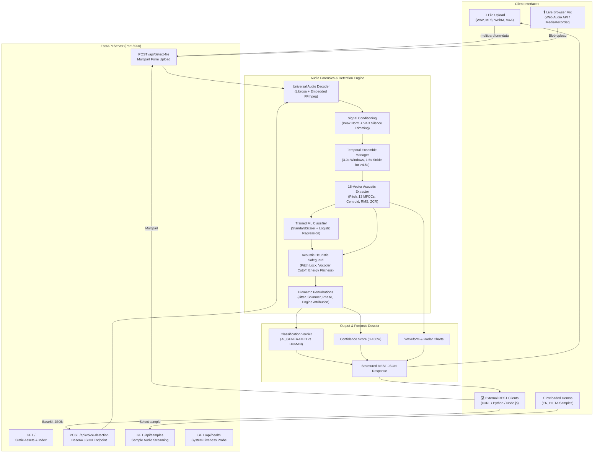

# 🎙️ Deepfake-Voice-Detection

<div align="center">

[](https://www.python.org/)
[](https://fastapi.tiangolo.com/)
[](https://scikit-learn.org/)
[](https://librosa.org/)
[](LICENSE)
[](https://github.com/dioatro/Deepfake-Voice-Dector)

**Next-Generation Multilingual AI-Generated vs. Human Voice Forensics & Detection System**

*An end-to-end cyber-forensics platform and REST API engineered to detect cloned voices, synthetic vocoders, neural speech synthesis (TTS), and audio deepfakes with acoustic feature extraction, multi-window segment ensembling, and biometric perturbation analysis.*

[Key Features](#-key-features) • [Workflow](#-workflow) • [Flowchart](#-flowchart-of-how-the-project-works) • [Tools Used](#-tools--technologies-used) • [Basic Requirements](#-basic-requirements--prerequisites) • [Installation & Setup](#-installation--setup) • [REST API](#-rest-api-documentation) • [Forensics Guide](#-acoustic-forensic-metrics-explained)

---

</div>

## 📖 Overview & Documentation

**Deepfake-Voice-Detector** is an acoustic analysis and digital forensics platform designed to determine whether a given voice sample is **synthetic / AI-generated** (e.g., ElevenLabs, HiFi-GAN, VALL-E, Tortoise-TTS) or an **authentic human voice**.

With the proliferation of zero-shot neural voice cloning and generative AI speech engines, malicious voice cloning has become a critical threat in financial fraud (vishing), executive impersonation, identity theft, and disinformation campaigns. This project delivers an explainable, real-time detection pipeline combining:

1. **Digital Signal Processing (DSP)**: Extracts 18 acoustic feature vectors characterizing vocal tract resonance, micro-tremors, and frequency distributions.
2. **Voice Activity Detection (VAD) & Peak Normalization**: Isolates active vocal frames and standardizes amplitude to eliminate microphone gain and room ambience bias.
3. **Multi-Window Temporal Ensembling**: Slices extended audio clips (up to 60+ seconds) into overlapping windows to catch transient deepfakes and compute window consistency scores.
4. **Calibrated Machine Learning & Acoustic Heuristics**: An empirical Logistic Regression model paired with a rule-based acoustic safeguard that detects robotic pitch locks and high-frequency vocoder boost artifacts.
5. **Biometric Perturbation Profiling**: Quantifies vocal jitter, shimmer, phase continuity, and potential synthetic engine attribution.
6. **Dual Interaction Interface**: A cyber-forensics web portal (with live mic recording, interactive canvas waveforms, and radar charts) and a developer-friendly REST API.

---

## 🌟 Key Features

| Capability | Description |
| :--- | :--- |
| 🎧 **3 Flexible Input Channels** | Ingest audio via **Direct File Upload** (`.wav`, `.mp3`, `.ogg`, `.flac`, `.m4a`, `.aac`, `.webm`), **Live Browser Microphone** (Web Audio API with real-time waveform), or **1-Click Preloaded Demos**. |
| 🔬 **18-Dimensional Acoustic Vectors** | Extracts fundamental pitch $F_0$ mean & standard deviation, 13 Mel-Frequency Cepstral Coefficients (MFCCs), Spectral Centroid, Root Mean Square (RMS) energy variance, and Zero-Crossing Rate (ZCR). |
| 🪟 **Multi-Window Temporal Ensemble** | For audio > 4.5s (supporting recordings up to 60s+), uses 3.0-second sliding windows with 1.5-second stride. Merges median probabilities with majority voting and outputs a window consistency percentage. |
| 🧬 **Biometric Perturbation Dossier** | Evaluates **Jitter %** (pitch perturbation), **Shimmer %** (amplitude perturbation), **Phase Continuity Index**, and maps acoustic signatures to **Suspected Synthesis Engines** (e.g., ElevenLabs Turbo v2.5, HiFi-GAN Vocoder, VALL-E Latent Hybrid). |
| ⚡ **Universal In-Memory Audio Decoder** | Powered by Librosa and bundled standalone FFmpeg (`imageio-ffmpeg`). Accepts arbitrary browser `MediaRecorder` Opus/WebM streams or lossy/lossless files and resamples to uniform 16 kHz mono PCM float32 in memory. |
| 🔇 **VAD & Silence Suppression** | Strips out silent intervals and breath pauses (`top_db=25`) so unvoiced pauses don't skew spectral centroids or trigger false synthetic classifications. |
| 🌐 **Multilingual & Language-Agnostic** | Evaluated across English, Tamil (தமிழ்), Hindi (हिन्दी), Malayalam (മലയാളം), Telugu (తెలుగు), and Auto-Detect. |
| 📊 **Interactive Canvas Waveform** | Renders 70-band audio peaks with click-to-seek playback, real-time playback cursor, and interactive playback preview. |
| 🔌 **Developer REST API** | Features both a high-throughput multipart file upload route (`/api/detect-file`) and a Base64 JSON endpoint (`/api/voice-detection`) with optional API key security. |

---

## 🔄 Workflow

The system operates across two intertwined workflows: the **User Experience Journey** and the **Internal Audio Forensics Processing Pipeline**.

### 1. End-to-End User Experience Journey

```text
1. Select Input Source  -->  2. Configure Language  -->  3. Preview & Validate  -->  4. Trigger Analysis  -->  5. Review Forensic Dossier
   • File Drag-and-Drop       • English, Hindi, Tamil     • Built-in audio player      • Live progress loader    • Verdict & Risk Level
   • Live Mic Recording       • Malayalam, Telugu         • Interactive waveform        • Universal decoding     • Confidence Gauge (0-100%)
   • Preloaded Demos          • Auto-Detect               • Duration & amplitude check  • ML + DSP execution     • Acoustic radar & MFCCs
                                                                                                                 • Biometric perturbation metrics
```

1. **Input Selection**: The analyst uploads an audio recording, records live speech via the browser microphone, or clicks one of the preloaded demo samples.
2. **Language Configuration**: The target language can be selected or set to `Auto-detect`.
3. **Inspection & Preview**: The user reviews the waveform representation and plays back the audio using the integrated player.
4. **Trigger Analysis**: Clicking **"Analyze Voice Sample"** transmits the audio to the FastAPI backend asynchronously.
5. **Dossier Generation**: The portal displays the classification badge (`AI GENERATED` or `HUMAN VOICE`), confidence score, detailed acoustic rationale, biometric indicators, and session history.

---

### 2. Internal Audio Forensics Pipeline Workflow

```text
[Raw Audio Binary]
       │
       ▼
[Stage 1: Universal In-Memory Decoding]
       ├─► Fast-path: Librosa / SoundFile (Direct WAV/MP3)
       └─► Fallback: Embedded FFmpeg Subprocess Pipe (WebM, Opus, OGG, AAC, M4A, FLAC)
       └─► Standardize to Mono 16,000 Hz float32 array
       │
       ▼
[Stage 2: Signal Conditioning & Quality Gates]
       ├─► Check duration (minimum 0.6 seconds)
       ├─► Ambient noise threshold (max amplitude < 0.015 triggers SILENCE status)
       ├─► Peak normalization (target peak = 0.85 to cancel mic distance/gain variance)
       └─► Voice Activity Detection (librosa.effects.split at top_db=25) to isolate speech
       │
       ▼
[Stage 3: Feature Extraction & Temporal Ensembling]
       ├─► Short Audio (≤ 4.5s): Direct single-frame extraction on voiced segments
       └─► Extended Audio (> 4.5s): Sliding window (3.0s window, 1.5s stride)
             ├─► Extract 18 acoustic vectors per window (Pitch F0, 13 MFCCs, Centroid, RMS, ZCR)
             ├─► Compute window ML probabilities
             ├─► Aggregate via 65% Median + 35% Majority Vote
             └─► Calculate Window Consistency %
       │
       ▼
[Stage 4: Hybrid Decision Engine & Heuristic Safeguard]
       ├─► Scikit-Learn StandardScaler & Logistic Regression inference
       ├─► Acoustic Heuristic Checks:
       │     • Pitch standard deviation (< 28 Hz = severe monotone lock)
       │     • Spectral centroid (> 3100 Hz = high-frequency vocoder cutoff)
       │     • RMS standard deviation (< 0.012 = flat synthetic dynamic energy)
       │     • Zero-crossing rate (> 0.16 = vocoder carrier harmonics)
       └─► Calibrate probability & override potential false negatives
       │
       ▼
[Stage 5: Biometric Perturbation & Attribution Analysis]
       ├─► Compute Jitter % (pitch perturbation) and Shimmer % (amplitude perturbation)
       ├─► Calculate Phase Continuity Index
       └─► Profile suspected synthesis engine (ElevenLabs, HiFi-GAN, VALL-E, Tortoise-TTS)
       │
       ▼
[Stage 6: Client Delivery]
       └─► Deliver structured JSON payload with waveform peaks, MFCCs, verdict & rationale
```

---

## 📊 Flowchart of How the Project Works

### System Architecture Flowchart

The following flowchart illustrates the high-level communication architecture between client applications, server endpoints, and internal processing units:



---

### Detailed Acoustic Signal Processing & Decision Tree

The following diagram details the exact algorithmic logic applied inside `detector.py`:

```mermaid
flowchart TD
    Start(["Raw Audio Input Received"]) --> Dec{"Decode with\nLibrosa/Soundfile?"}
    Dec -- Yes --> Mono["Convert to Mono 16 kHz PCM float32"]
    Dec -- No / Fail --> FFmpeg["Pipe into Embedded FFmpeg Subprocess\n(-f f32le -ac 1 -ar 16000)"]
    FFmpeg --> Mono

    Mono --> DurCheck{"Audio Duration < 0.6s?"}
    DurCheck -- Yes --> ErrShort["Raise Error: Audio Too Short"]
    DurCheck -- No --> SilenceCheck{"Max Amplitude < 0.015?"}

    SilenceCheck -- Yes --> RetSilence["Return Status: SILENCE\n(Awaiting Speech Input)"]
    SilenceCheck -- No --> PeakNorm1["Peak Normalization\n(Target Peak = 0.85)"]

    PeakNorm1 --> VADSplit["Extract Voiced Speech Frames\n(librosa.effects.split, top_db=25)"]
    VADSplit --> PeakNorm2["Peak Normalization on Voiced Audio"]

    PeakNorm2 --> LengthCheck{"Voiced Audio > 4.5s?"}

    LengthCheck -- Yes --> SlidingWin["Sliding Window Temporal Ensemble\n(Window: 3.0s, Stride: 1.5s)"]
    SlidingWin --> WindowFeats["Extract 18 Acoustic Vectors per Window"]
    WindowFeats --> WindowProbs["Predict Window Probabilities via Model"]
    WindowProbs --> Aggregate["Ensemble Probability Aggregation:\nProb = 0.65 × Median + 0.35 × Majority_Vote\nCalculate Window Consistency %"]

    LengthCheck -- No --> SingleFrame["Single Frame Feature Extraction\n(Pitch, 13 MFCCs, Centroid, RMS, ZCR)"]
    SingleFrame --> MLPredict["Predict Initial Probability (Prob_AI)"]

    Aggregate --> HeuristicEval
    MLPredict --> HeuristicEval

    subgraph HeuristicEval ["Acoustic Heuristic Checks"]
        H1["Check 1: Pitch Std < 28 Hz (Severe Monotone Lock)"]
        H2["Check 2: Centroid > 3100 Hz (High-Frequency Vocoder Emphasis)"]
        H3["Check 3: RMS Std < 0.012 (Flat Dynamic Energy Modulation)"]
        H4["Check 4: ZCR > 0.16 (Elevated Vocoder Carrier Harmonics)"]
    end

    HeuristicEval --> Calibrate{"Heuristic Score >= 2\nand Prob_AI < 0.50?"}
    Calibrate -- Yes --> Override["Override ML False-Negative:\nProb_AI = max(0.82, Prob_AI + 0.45)"]
    Calibrate -- No --> CheckBoost{"Heuristic Score >= 1?"}
    CheckBoost -- Yes --> Boost["Boost Synthetic Confidence Score"]
    CheckBoost -- No --> FinalProb["Keep Calibrated Prob_AI"]

    Override --> Decision{"Prob_AI >= 0.50?"}
    Boost --> Decision
    FinalProb --> Decision

    Decision -- Yes --> AI_Res["Verdict: AI_GENERATED\nTheme: Danger (Red)\nRisk: High Probability of AI Synthesis"]
    Decision -- No --> Human_Res["Verdict: HUMAN\nTheme: Success (Green)\nRisk: Authentic Human Speech"]

    AI_Res --> Perturb["Compute Biometric Perturbations:\n• Jitter & Shimmer Perturbations\n• Phase Continuity Index\n• Suspected Synthesis Engine"]
    Human_Res --> Perturb

    Perturb --> Done(["Emit Forensic Response Payload"])
```



---

## 🛠️ Tools & Technologies Used

### Backend & Server Architecture
- **[Python 3.10+](https://www.python.org/)**: Core runtime environment delivering optimal typing, audio library compatibility, and performance.
- **[FastAPI](https://fastapi.tiangolo.com/) (0.115+)**: Asynchronous, high-performance web framework providing OpenAPI specifications, auto-validation, and ASGI streaming.
- **[Uvicorn](https://www.uvicorn.org/) (0.30+)**: Lightning-fast ASGI server implementation for Python.
- **[python-multipart](https://andrew-d.github.io/python-multipart/)**: Enables streaming multipart/form-data audio file uploads.
- **[HTTPX](https://www.python-httpx.org/)**: Fully featured HTTP client used for backend integrations and automated testing.

### Audio DSP & Feature Engineering
- **[Librosa](https://librosa.org/) (0.10+)**: Industry-standard audio and music analysis library used for:
  - Parabolic interpolation pitch tracking (`librosa.piptrack`).
  - Voice Activity Detection segmentation (`librosa.effects.split`).
  - Mel-Frequency Cepstral Coefficients computation (`librosa.feature.mfcc`).
  - Spectral centroid estimation (`librosa.feature.spectral_centroid`).
  - Root Mean Square energy measurement (`librosa.feature.rms`).
  - Zero-crossing rate tracking (`librosa.feature.zero_crossing_rate`).
- **[SoundFile](https://python-soundfile.readthedocs.io/) (0.12+)**: Audio library based on `libsndfile` for rapid C-speed reading of uncompressed and lossy audio files.
- **[imageio-ffmpeg](https://github.com/imageio/imageio-ffmpeg) (0.5+)**: Bundles self-contained, multi-platform FFmpeg binaries, guaranteeing transparent decoding of WebM Opus, AAC, and M4A streams without requiring system-level package managers.
- **[NumPy](https://numpy.org/) (1.26+)**: Vectorized numerical operations, fast signal manipulation, and array-based acoustic computations.

### Machine Learning & Forensics
- **[Scikit-Learn](https://scikit-learn.org/) (1.5+)**:
  - `StandardScaler`: Normalizes multi-dimensional feature distributions.
  - `LogisticRegression`: Calibrated binary classification model outputting posterior class probabilities.
- **[Joblib](https://joblib.readthedocs.io/)**: High-throughput model serialization and deserialization (`voice_model.pkl`).

### Frontend & Cyber-Forensics UI
- **HTML5 & Modern CSS3**: Responsive design with CSS Custom Properties, dark cyber-forensic color palette (deep slate, cyan, emerald green, crimson red), glassmorphism, and Material Symbols.
- **Vanilla JavaScript (ES6+)**:
  - **Web Audio API**: Real-time audio context management and dynamic frequency analysis.
  - **MediaRecorder API**: In-browser microphone audio capture across desktop and mobile devices.
  - **HTML5 Canvas**: Dynamic rendering of 70-bar waveform peaks with interactive scrub-seek mechanics.
  - **Local Storage API**: Client-side persistence of forensic analysis history across browser sessions.

---

## 📋 Basic Requirements & Prerequisites

### System Requirements
| Component | Minimum Specification | Recommended Specification |
| :--- | :--- | :--- |
| **Operating System** | macOS 12+, Ubuntu 20.04+, Windows 10/11 | macOS 14+, Ubuntu 22.04+, Windows 11 (64-bit) |
| **Python** | Python 3.10.x | Python 3.11.x |
| **RAM** | 2 GB Available RAM | 4 GB+ RAM |
| **Storage** | 350 MB free disk space | 1 GB free disk space |
| **Microphone** | Any standard audio input device | Directional USB or built-in noise-canceling mic |
| **Web Browser** | Chrome 90+, Edge 90+, Firefox 88+, Safari 15+ | Latest Chrome, Brave, or Edge (Web Audio API) |

### Audio Input Specifications
- **Supported Containers**: `.wav`, `.mp3`, `.ogg`, `.flac`, `.m4a`, `.aac`, `.webm`.
- **Minimum Duration**: 0.6 seconds of active speech.
- **Recommended Duration**: 3.0 to 15.0 seconds (audio > 4.5s automatically triggers multi-window temporal ensembling).
- **Sampling Rate**: Any (internally resampled to 16,000 Hz mono PCM).

---

## 🚀 Installation & Setup

### Step 1: Clone the Repository

```bash
git clone https://github.com/dioatro/Deepfake-Voice-Dector.git
cd Deepfake-Voice-Dector
```

### Step 2: Set Up a Python Virtual Environment

#### On macOS & Linux:
```bash
python3 -m venv venv
source venv/bin/activate
```

#### On Windows (PowerShell):
```powershell
python -m venv venv
.\venv\Scripts\Activate.ps1
```

#### On Windows (Command Prompt):
```cmd
python -m venv venv
venv\Scripts\activate.bat
```

### Step 3: Install Required Dependencies

```bash
pip install --upgrade pip
pip install -r requirements.txt
```

> **Note on FFmpeg**: You do **not** need to install FFmpeg separately on your operating system. The `imageio-ffmpeg` dependency automatically downloads and manages a lightweight standalone FFmpeg executable.

---

## 🏃 Running the Application

### Option 1: Using 1-Click Launch Scripts

- **macOS / Linux**:
  ```bash
  chmod +x run.sh
  ./run.sh
  ```
- **Windows (Batch)**: Double-click `run.bat` (or execute `run.bat` in Command Prompt).
- **Windows (PowerShell)**: Right-click `run.ps1` -> *Run with PowerShell* (or execute `.\run.ps1`).

### Option 2: Using the Command Line Interface

```bash
python -m uvicorn app:app --host 127.0.0.1 --port 8000 --reload
```

Once launched, access the web portal at:
👉 **[http://127.0.0.1:8000](http://127.0.0.1:8000)**

---

## 📡 REST API Documentation

The server exposes robust REST endpoints for integration into third-party security stacks, automated fraud-detection pipelines, and mobile apps.

### 1. Multipart Audio File Upload
Upload raw audio files directly for forensic inspection.

- **Endpoint**: `POST /api/detect-file`
- **Content-Type**: `multipart/form-data`

#### Request Parameters:
| Parameter | Type | Required | Description |
| :--- | :--- | :--- | :--- |
| `file` | Binary File | Yes | Audio file (`.wav`, `.mp3`, `.ogg`, `.flac`, `.m4a`, `.webm`) |
| `language` | String | No | Spoken language (Default: `"Auto-detect"`) |

#### cURL Example:
```bash
curl -X POST http://127.0.0.1:8000/api/detect-file \
  -F "file=@sample_voice.wav" \
  -F "language=English"
```

#### Python Example:
```python
import requests

url = "http://127.0.0.1:8000/api/detect-file"
with open("sample_voice.wav", "rb") as f:
    files = {"file": ("sample_voice.wav", f, "audio/wav")}
    data = {"language": "English"}
    response = requests.post(url, files=files, data=data)

print(response.json())
```

#### JavaScript / Fetch Example:
```javascript
const formData = new FormData();
formData.append("file", audioBlob, "recording.webm");
formData.append("language", "English");

const res = await fetch("http://127.0.0.1:8000/api/detect-file", {
  method: "POST",
  body: formData
});
const report = await res.json();
console.log(report);
```

---

### 2. Base64 JSON Detection Endpoint
Adheres to standardized JSON payloads for server-to-server microservices.

- **Endpoint**: `POST /api/voice-detection`
- **Content-Type**: `application/json`
- **Headers**: `x-api-key: <API_KEY>` (Optional; default is `test_key_123` unless customized)

#### Request Body:
```json
{
  "language": "English",
  "audioFormat": "wav",
  "audioBase64": "UklGRiQAAABXQVZFZm10IBAAAAABAAEA..."
}
```

#### Response Body:
```json
{
  "status": "success",
  "language": "English",
  "classification": "AI_GENERATED",
  "confidenceScore": 0.94,
  "confidencePercent": 94,
  "explanation": "Extended 60s ensemble analyzed across 4 speech frames (100% consistency): Detected persistent vocoder spectral patterns, mechanical formant constraints, and synthetic pitch dynamics.",
  "riskLevel": "HIGH PROBABILITY OF AI SYNTHESIS",
  "duration": 5.82,
  "features": {
    "pitch_mean": 184.2,
    "pitch_std": 18.4,
    "spectral_centroid_mean": 3240.1,
    "rms_std": 0.0098,
    "zcr_mean": 0.1742,
    "mfccs": [
      { "index": 1, "label": "MFCC 1", "value": -245.12 },
      { "index": 2, "label": "MFCC 2", "value": 78.43 }
    ]
  },
  "waveformPeaks": [0.12, 0.45, 0.88, 0.65, 0.32]
}
```

---

### 3. Additional Endpoints

| Method | Endpoint | Description |
| :--- | :--- | :--- |
| `GET` | `/api/health` | Service health status and API version (`{"status": "ok", "version": "2.0.0"}`). |
| `GET` | `/api/samples` | Returns JSON catalog of preloaded test files (English, Hindi, Tamil AI & Human demos). |
| `GET` | `/api/sample-audio/{sample_id}` | Streams audio binary for a preloaded test sample. |

---

## 🔬 Acoustic Forensic Metrics Explained

The detector computes an 18-dimensional acoustic feature space along with biometric perturbation indexes:

```text
┌─────────────────────────────────────────────────────────────────────────────┐
│                       ACOUSTIC FEATURE VECTOR MATRIX                        │
├──────────────────────┬────────────────────────┬─────────────────────────────┤
│ Feature Metric       │ Natural Human Speech   │ AI / Cloned / Vocoder Voice │
├──────────────────────┼────────────────────────┼─────────────────────────────┤
│ Pitch Std Dev (F0)   │ 45 Hz - 140 Hz         │ < 28 Hz (Monotone Lock)     │
│ Spectral Centroid    │ 1,200 Hz - 2,600 Hz    │ > 3,000 Hz (Vocoder Boost)  │
│ RMS Energy Variance  │ > 0.030 (Micro-pauses) │ < 0.012 (Flat Modulation)   │
│ Zero-Crossing Rate   │ 0.040 - 0.110          │ > 0.160 (Carrier Harmonics) │
│ Jitter (Pitch Pert.) │ 0.65% - 1.40%          │ < 0.24% (Unnaturally Flat)  │
│ Shimmer (Amp. Pert.) │ 2.20% - 4.50%          │ < 0.95% (Synthetic Smooth)  │
│ Phase Continuity     │ 85% - 99%              │ 28% - 55% (Neural Artifact) │
└──────────────────────┴────────────────────────┴─────────────────────────────┘
```

1. **Fundamental Pitch Standard Deviation (`pitch_std`)**: Human vocal cords experience natural neuromuscular micro-tremors and expressive prosodic inflections. Neural vocoders often display unnaturally rigid or clamped pitch trajectories.
2. **Spectral Centroid (`spectral_centroid_mean`)**: Measures the "center of mass" of the sound's frequency spectrum. Neural vocoders (like HiFi-GAN or WaveGlow) often over-emphasize high frequencies to synthesize clean consonants, producing an unnaturally high centroid.
3. **RMS Energy Deviation (`rms_std`)**: Human conversation is punctuated by breath pauses, syllabic volume rises, and cadence changes. Synthetic audio frequently exhibits unnaturally flat energy modulation across syllables.
4. **Zero-Crossing Rate (`zcr_mean`)**: The rate at which the signal changes sign. High-frequency synthesis artifacts and vocoder carrier buzzing inflate the zero-crossing rate.
5. **13 MFCC Coefficients**: Mel-Frequency Cepstral Coefficients model the human vocal tract filter shape. Discrepancies between biological vocal resonances and algorithmic acoustic filters are captured across these 13 coefficients.
6. **Jitter & Shimmer Perturbations**:
   - **Jitter**: Cycle-to-cycle frequency variation of vocal fold vibration.
   - **Shimmer**: Cycle-to-cycle amplitude variation of sound waves. Synthetic speech engines consistently minimize these organic irregularities.

---

## 📁 Project Directory Structure

```
Deepfake-Voice-Dector/
├── app.py                     # FastAPI application, static routing & REST endpoints
├── detector.py                # Audio decoding, VAD, sliding window ensemble & ML logic
├── features.py                # 18-feature acoustic extractor (Pitch, MFCCs, Centroid, RMS, ZCR)
├── voice_model.pkl            # Pre-trained Scikit-Learn Logistic Regression & Scaler pipeline
├── requirements.txt           # Python dependency manifest
├── run.sh                     # Cross-platform macOS / Linux startup launcher
├── run.bat                    # 1-Click Windows Batch startup script
├── run.ps1                    # 1-Click Windows PowerShell startup script
├── README.md                  # Project documentation, workflow, and architecture guide
└── static/
    ├── index.html             # Cyber-forensic web portal UI
    ├── style.css              # Cyber-theme stylesheet, glowing badges, responsive grid
    ├── app.js                 # Web Audio API, MediaRecorder, Canvas visualizer & REST client
    └── samples/               # Preloaded demonstration audio clips
        ├── sample_ai_en.mp3   # Synthetic English TTS sample
        ├── sample_ai_hi.mp3   # Synthetic Hindi TTS sample
        ├── sample_ai_ta.mp3   # Synthetic Tamil TTS sample
        └── sample_human_demo.wav # Authentic organic human voice sample
```

---

## 🧪 Testing & Verification

To verify that all services, audio decoders, and classification routines are functioning properly:

```bash
# 1. Start the server
python -m uvicorn app:app --host 127.0.0.1 --port 8000 &

# 2. Test the health check endpoint
curl -s http://127.0.0.1:8000/api/health

# 3. Test the detection endpoint with a preloaded sample
curl -s -X POST http://127.0.0.1:8000/api/detect-file \
  -F "file=@static/samples/sample_ai_en.mp3" \
  -F "language=English"
```

---

## 🤝 Contributing

Contributions from security researchers, audio forensic analysts, and developers are welcome!

1. **Fork the Repository** on GitHub.
2. **Create a Feature Branch**:
   ```bash
   git checkout -b feature/advanced-spectrogram-analysis
   ```
3. **Commit Your Enhancements**:
   ```bash
   git commit -m "Add mel-spectrogram visualizer and CQ-CC feature extractor"
   ```
4. **Push to Your Branch**:
   ```bash
   git push origin feature/advanced-spectrogram-analysis
   ```
5. **Submit a Pull Request** with details regarding your acoustic findings or model improvements.

---

## 📄 License & Attribution

- **License**: Distributed under the **[MIT License](LICENSE)**.
- **Original Model Foundation**: Inspired by research in acoustic voice classification by [thekripaverse](https://github.com/thekripaverse/AI-Generated-Voice-Detection.git).
- **Forensic Portal & Enhancements**: Engineered with FastAPI, Librosa, Scikit-Learn, and the Web Audio API by **[dioatro](https://github.com/dioatro/Deepfake-Voice-Dector)**.
